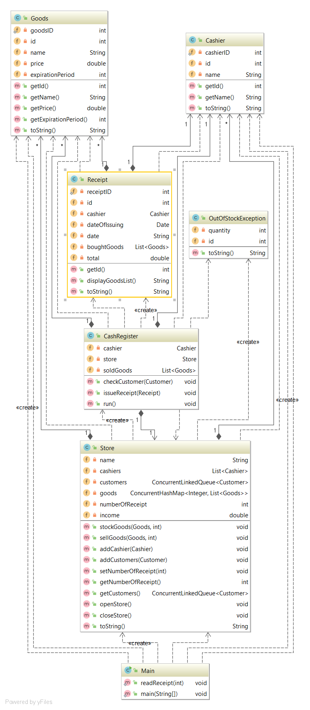

# Course work for Java course
The main purpose of this project is to demonstrate my knowledge of matters covered by my Java university course.
The requirements of the projects are to:
* Follow SOLID principles
* Use multithreading 
* Work with files
* Work with custom exceptions
* Use appropriate class architecture
* Use appropriate data structures to store data

The context of the project is a store with multiple cash ragisters which service their own queue of customers. After a customer is serviced, a new .txt file with their receipt is generated.

### When ran, the program creates additional .txt files which are the customer receipts generated after their purchase.

